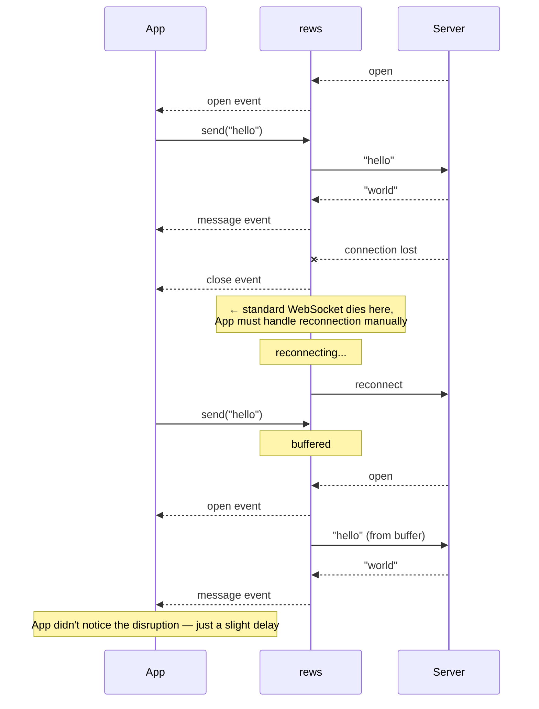

# @nktkas/rews

[](https://www.npmjs.com/package/@nktkas/rews)
[](https://jsr.io/@nktkas/rews)
[](https://bundlejs.com/?q=@nktkas/rews)

Drop-in [`WebSocket`](https://developer.mozilla.org/en-US/docs/Web/API/WebSockets_API) replacement with automatic
reconnection.

---

**Without rews** — manual reconnection, listener re-attachment, message queuing:

```ts
let ws: WebSocket;
let attempts = 0;
const queue: string[] = [];
const onMessage = (e: MessageEvent) => console.log(e.data);

function connect() {
  ws = new WebSocket("wss://example.com");
  ws.addEventListener("message", onMessage);
  ws.onopen = () => {
    attempts = 0;
    while (queue.length) ws.send(queue.shift()!);
  };
  ws.onclose = () => {
    if (attempts++ < 3) setTimeout(connect, 1000);
  };
}

function send(data: string) {
  ws.readyState === WebSocket.OPEN ? ws.send(data) : queue.push(data);
}

connect();
send("hello");
```

**With rews:**

```ts
import { ReconnectingWebSocket } from "@nktkas/rews";

const ws = new ReconnectingWebSocket("wss://example.com");
ws.addEventListener("message", (e) => console.log(e.data));
ws.send("hello");
```

## How It Works



## Features

- **Drop-in replacement** — standard `WebSocket` API, swap one line
- **Auto-reconnection** — configurable retries with exponential backoff
- **Persistent listeners** — `addEventListener` and `on*` handlers survive reconnections
- **Dynamic URL & protocols** — factory functions for per-reconnect resolution
- **Zero dependencies** — works in Node.js, Deno, Bun, and browsers

## Install

```
npm i @nktkas/rews        # npm / pnpm / yarn
deno add jsr:@nktkas/rews # Deno
bun add @nktkas/rews      # Bun
```

## Usage

```ts
import { ReconnectingWebSocket } from "@nktkas/rews";

const ws = new ReconnectingWebSocket("wss://example.com", {
  maxRetries: 5,
  reconnectionDelay: (attempt) => Math.min(2 ** attempt * 200, 30_000),
});

ws.addEventListener("message", (e) => console.log(e.data));
ws.addEventListener("terminate", (e) => console.error(e.detail.code));

ws.send("hello"); // buffered if not yet connected
```

## Options

```ts
interface ReconnectingWebSocketOptions {
  /** Custom WebSocket constructor. @default globalThis.WebSocket */
  WebSocket?: typeof WebSocket;
  /** Maximum number of reconnection attempts. @default 3 */
  maxRetries?: number;
  /** Connection timeout in ms (null to disable). @default 10_000 */
  connectionTimeout?: number | null;
  /** Delay before reconnection in ms, or a function of attempt number. @default exponential backoff, max 10s */
  reconnectionDelay?: number | ((attempt: number) => number);
}
```

## Beyond Standard WebSocket

### Dynamic URL & Protocols

`url` and `protocols` accept functions, invoked on each reconnection:

```ts
const ws = new ReconnectingWebSocket(
  () => `wss://example.com?token=${getToken()}`,
  () => ["v2"],
);
```

### Event Lifecycle

Standard `open`, `close`, `error`, and `message` events fire on **every** connection cycle — not just the first one. A
single `ReconnectingWebSocket` instance may emit multiple `open`/`close` pairs over its lifetime as it reconnects.

```ts
ws.addEventListener("open", () => console.log("connected")); // fires on each (re)connection
ws.addEventListener("close", () => console.log("disconnected")); // fires on each disconnection

// use { once: true } if you only need the first occurrence
ws.addEventListener("open", () => init(), { once: true });
```

### Terminate Event

Fires when the connection is permanently closed:

| Code                 | Description                                |
| -------------------- | ------------------------------------------ |
| `RECONNECTION_LIMIT` | Max retries exceeded                       |
| `TERMINATED_BY_USER` | `close()` called                           |
| `UNKNOWN_ERROR`      | Unhandled error in user-provided functions |

```ts
ws.addEventListener("terminate", (e) => {
  e.detail.code; // ReconnectingWebSocketErrorCode
  e.detail.cause; // original error, if any
});

ws.isTerminated; // boolean
ws.terminationReason; // ReconnectingWebSocketError | undefined
ws.terminationSignal; // AbortSignal
```

### Closing Behavior

```ts
ws.close(); // permanently close (default)
ws.close(code, reason, false); // close current socket only — reconnection continues
```

## License

[MIT](./LICENSE)
