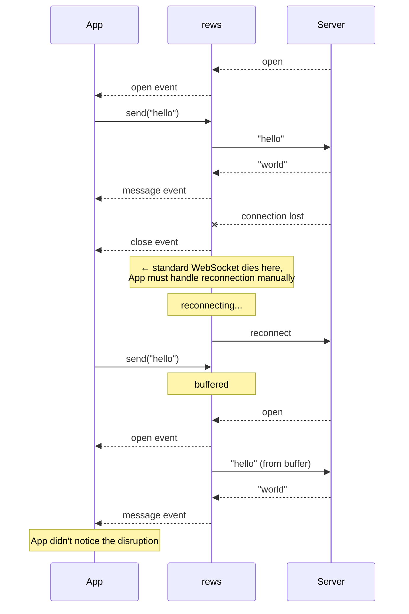

# @nktkas/rews

[](https://www.npmjs.com/package/@nktkas/rews)
[](https://jsr.io/@nktkas/rews)
[](https://bundlejs.com/?q=@nktkas/rews)

Drop-in [`WebSocket`](https://developer.mozilla.org/en-US/docs/Web/API/WebSockets_API) replacement with automatic
reconnection.

---

**Without rews** — manual reconnection, listener re-attachment, message queuing:

```ts
let ws: WebSocket;
let attempts = 0;
const queue: string[] = [];
const onMessage = (e: MessageEvent) => console.log(e.data);

function connect() {
  ws = new WebSocket("wss://example.com");
  ws.addEventListener("message", onMessage);
  ws.onopen = () => {
    attempts = 0;
    while (queue.length) ws.send(queue.shift()!);
  };
  ws.onclose = () => {
    if (attempts++ < 3) setTimeout(connect, 1000);
  };
}

function send(data: string) {
  ws.readyState === WebSocket.OPEN ? ws.send(data) : queue.push(data);
}

connect();
send("hello");
```

**With rews** — standard `WebSocket` API, no changes needed:

```ts
import { ReconnectingWebSocket } from "@nktkas/rews";

const ws = new ReconnectingWebSocket("wss://example.com");
ws.addEventListener("message", (e) => console.log(e.data));
ws.send("hello");
```

## How It Works


```mermaid
sequenceDiagram
    participant App
    participant rews
    participant Server

    Server-->>rews: open  
    rews-->>App: open event

    App->>rews: send("hello")
    rews->>Server: "hello"
    Server-->>rews: "world"
    rews-->>App: message event

    Server--xrews: connection lost
    rews-->>App: close event
    Note over rews: ← standard WebSocket dies here,<br/>App must handle reconnection manually

    Note over rews: reconnecting...
    rews->>Server: reconnect

    App->>rews: send("hello")
    Note over rews: buffered

    Server-->>rews: open
    rews-->>App: open event
    rews->>Server: "hello" (from buffer)
    Server-->>rews: "world"
    rews-->>App: message event

    Note over App: App didn't notice the disruption
```

## Features

- **Drop-in replacement** — standard `WebSocket` API, swap one line
- **Auto-reconnection** — configurable retries and delay strategy
- **Message buffering** — `send()` queues data while offline, flushes on reconnect
- **Persistent listeners** — `addEventListener` and `on*` handlers survive reconnections
- **Dynamic URL & protocols** — resolve fresh values on each reconnection
- **Zero dependencies** — works in Node.js, Deno, Bun, and browsers

## Install

```
npm i @nktkas/rews          # npm
pnpm add @nktkas/rews       # pnpm
yarn add @nktkas/rews       # yarn
deno add jsr:@nktkas/rews   # Deno
bun add @nktkas/rews        # Bun
```

Or import directly via CDN (no install):

```html
<script type="module">
  import { ReconnectingWebSocket } from "https://esm.sh/@nktkas/rews";
</script>
```

### React Native

Hermes lacks the global `EventTarget` / `Event` that rews needs — polyfill them before importing rews:

```js
import { Event, EventTarget } from "event-target-shim";
if (!globalThis.EventTarget) globalThis.EventTarget = EventTarget;
if (!globalThis.Event) globalThis.Event = Event;
```

React Native ships an `AbortController` polyfill that drops the `abort()` reason, leaving `terminationSignal.reason`
undefined — replace it with one that keeps it:

```js
import { AbortController, AbortSignal } from "abortcontroller-polyfill/dist/cjs-ponyfill";
globalThis.AbortController = AbortController;
globalThis.AbortSignal = AbortSignal;
```

## Options

```ts
interface ReconnectingWebSocketOptions {
  /** Maximum number of consecutive failed reconnection attempts. @default Infinity */
  maxRetries?: number;
  /** Connection timeout in ms (null to disable). @default 10_000 */
  connectionTimeout?: number | null;
  /** Time in ms a connection must stay open before the retry counter resets. @default 3_000 */
  stableTimeout?: number;
  /** Delay before reconnection in ms, or a function of attempt number. @default exponential backoff with jitter, max 10s */
  reconnectionDelay?: number | ((attempt: number) => number);
  /** Decide whether to reconnect after a non-user closure. @default () => true */
  shouldReconnect?: (event: CloseEvent, attempt: number) => boolean;
}
```

## Beyond Standard WebSocket

### Dynamic URL & Protocols

`url` and `protocols` accept functions (mb async), invoked on each reconnection:

```ts
const ws = new ReconnectingWebSocket(
  () => `wss://example.com?token=${getToken()}`,
  () => ["v2"],
);
```

Errors thrown by these functions count as failed connection attempts and follow the normal retry flow. The same applies
to a permanently invalid URL: with the default `maxRetries: Infinity` it is retried forever, each close event carrying
the error in its `reason`.

### Event Lifecycle

Standard `open`, `close`, `error`, and `message` events fire on **every** connection cycle — not just the first one. A
single `ReconnectingWebSocket` instance may emit multiple `open`/`close` pairs over its lifetime as it reconnects.

```ts
ws.addEventListener("open", () => console.log("connected")); // fires on each (re)connection
ws.addEventListener("close", () => console.log("disconnected")); // fires on each disconnection

// use { once: true } if you only need the first occurrence
ws.addEventListener("open", () => init(), { once: true });
```

### readyState

`CLOSED` means permanently terminated. While reconnecting — a retry pause, a connection attempt, a url/protocols factory
await — `readyState` is `CONNECTING`; `CLOSING` is never reported.

### Termination

`terminationSignal` is an [`AbortSignal`](https://developer.mozilla.org/en-US/docs/Web/API/AbortSignal) that aborts when
the connection is permanently closed. The abort reason is always a `ReconnectingWebSocketError`:

| Code                    | Description                                              |
| ----------------------- | -------------------------------------------------------- |
| `RECONNECTION_LIMIT`    | Max retries exceeded                                     |
| `RECONNECTION_DECLINED` | `shouldReconnect` returned `false`                       |
| `TERMINATED_BY_USER`    | `close()` called                                         |
| `UNKNOWN_ERROR`         | Unhandled error in `reconnectionDelay`/`shouldReconnect` |

```ts
ws.terminationSignal.aborted; // boolean
ws.terminationSignal.reason; // ReconnectingWebSocketError, once aborted

ws.terminationSignal.addEventListener("abort", () => {
  ws.terminationSignal.reason.code; // ReconnectingWebSocketErrorCode
  ws.terminationSignal.reason.cause; // original error, if any
});
```

Being a standard `AbortSignal`, it composes with `AbortSignal.any()`, `fetch()`, `addEventListener(..., { signal })`,
and other platform APIs.

### Closing Behavior

```ts
ws.close(code?, reason?); // permanently close — the standard WebSocket method
ws.reconnect(code?, reason?); // drop the current connection and reconnect immediately
```

`reconnect()` skips the current retry delay, is not counted towards `maxRetries`, and does nothing once the instance is
permanently terminated.

## License

**@nktkas/rews** is licensed under the [MIT License](LICENSE).

Copyright © 2025-present [nktkas](https://github.com/nktkas) and
[contributors](https://github.com/nktkas/rews/graphs/contributors).
